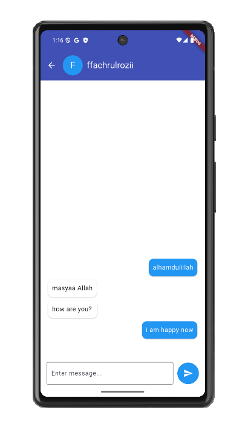
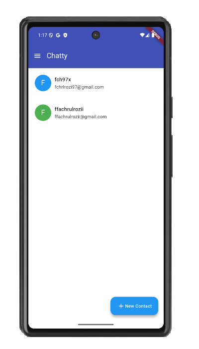

# My Budget

A financial notes app, write all our daily transaction, both income or outcome, and see it report based on type and date range.

There are several libraries used in this app, like: 

<table>
  <thead>
    <tr>
      <th>Library</th>
      <th>Description</th>
    </tr>
  </thead>
  <tbody>
    <tr>
      <td>flutter_riverpod</t>
      <td>State management</td>
    </tr>
    <tr>
      <td>google_sign_in</td>
      <td>Login with Google</td>
    </tr>
    <tr>
      <td>cloud_firestore</td>
      <td>Firestore database</td>
    </tr>
    <tr>
      <td colspan="2">and more (see pubspec.yaml)</td>
    </tr>
  </tbody>
</table>

These are several screens and it explanation:

<ul>
  <li>
    <b>Splash Screen</b>
    
Show splash screen for 2 seconds, then go to login page.

      
  </li>
  <li>
    <b>Login</b>
    
Enable user login to this app use Google SignIn

      
  </li>
  <li>
    <b>Drawer</b>
    
Show profile a little of user's account detail and show list of menus.

    
  </li>
  <li>
    <b>Chat List</b>
    
List of chats by current user, integrated to firestore.

    
  </li>
  <li>
    <b>Chat Detail</b>
    
Show messages between current user and target user. Enable user to send new chat.

    
  </li>
  <li>
    <b>Contact List</b>
    
Show list of current user's contacts. Integrated to firestore.

    
  </li>
  <li>
    <b>Contact Detail</b>
    
Show detail of a contact, enable to update data or remove it.

    
  </li>
</ul>
